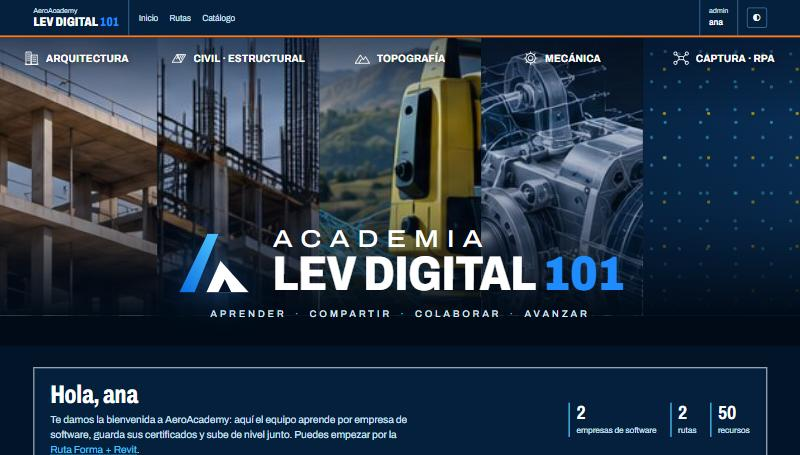
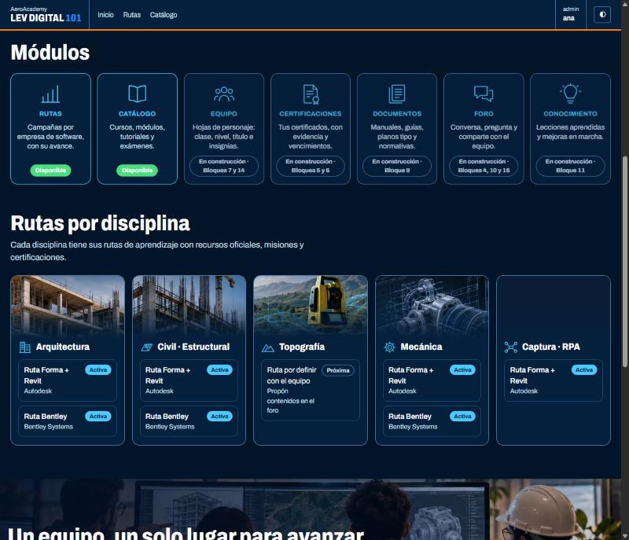
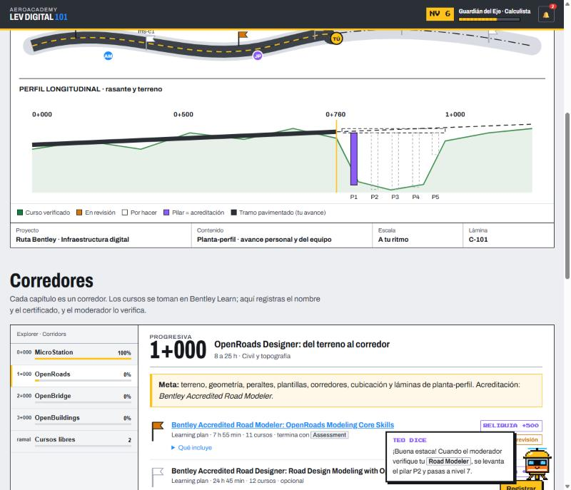
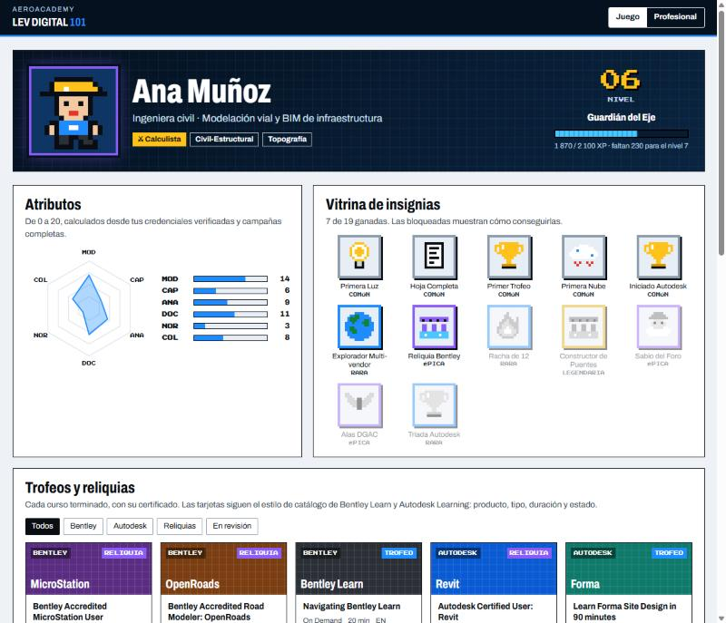
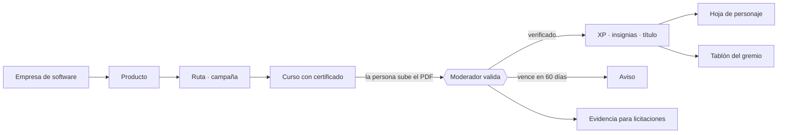

<div align="center">



# AeroAcademy

### Aprende. Certifica. Sube de nivel.

**La academia interna donde un equipo de ingeniería convierte cada curso y cada certificado en un progreso que se ve.**
Rutas por empresa de software, repositorio de credenciales con evidencia, y una capa de juego 8-bit para que dé gusto volver.

[](https://github.com/DovaCrii/AeroAcademy/actions/workflows/ci.yml)
[](LICENSE)
[](https://www.python.org/)
[](https://www.djangoproject.com/)
[](docs/PLAN.md)

Una iniciativa con el auspicio de **Suite Aero**: [AeroControl](https://github.com/DovaCrii/AeroControl) · [AeroBim](https://github.com/DovaCrii/AeroBim) · [AeroConvert](https://github.com/DovaCrii/AeroConvert) · AeroPlanner · AeroLink

</div>

---

## ¿Por qué existe?

Un equipo pequeño se capacita en muchas plataformas a la vez: Autodesk, Bentley, Trimble, Esri, drones y LiDAR.
El avance no se ve, lo aprendido no se comparte y los certificados quedan repartidos en correos y carpetas.
Cuando una licitación pide acreditar competencias, nadie sabe qué credencial está por vencer.

**AeroAcademy es un solo lugar, dentro de la red del equipo, donde todo eso se ordena, se valida y se celebra.**

- **Rutas por empresa de software.** Autodesk, Bentley y las que vengan: empresa → producto → campaña, filtradas por disciplina y habilidad.
- **El certificado es la prueba.** Cada curso se registra con su archivo; el moderador lo valida y recién ahí desbloquea XP, insignias y títulos.
- **Se juega, pero en serio.** Clases por disciplina, atributos tipo D&D, insignias en pixel-art y una hoja de personaje con vista profesional presentable a un cliente.
- **Un diseño distinto por especialidad.** El avance de Arquitectura se ve como un edificio que se llena; el de Civil, como un camino que se pavimenta hasta un puente.
- **Evidencia lista para licitar.** Vencimientos con aviso y exportación en ZIP + planilla.
- **Teo, el asistente.** Un teodolito 8-bit con hélice de dron que conoce las rutas y el foro.

## Míralo

| Bienvenida | Módulos y rutas por disciplina |
|---|---|
|  |  |

| Mundo Civil · Ruta Bentley (concepto) | Hoja de personaje (concepto) |
|---|---|
|  |  |

> Los conceptos navegables están en [`design/`](design/): [`mundos/civil.html`](design/mundos/civil.html) y [`perfil/hoja-personaje.html`](design/perfil/hoja-personaje.html).

## Cómo funciona



Hay dos tipos de ruta:

| Tipo | Qué es | Ejemplo |
|---|---|---|
| **Estructurada** | Niveles, misiones, mini quiz, notas y kit del equipo | Ruta Forma + Revit (CC 410) |
| **Externa** | Lista curada de cursos de un sitio que ya entrega certificado; se avanza registrando el curso y su certificado | Ruta Bentley (Bentley Learn) |

## Un mundo por especialidad

| Mundo | Metáfora | El avance se ve como… |
|---|---|---|
| Arquitectura | Plano: corte, láminas, *Project Browser* | Pisos del edificio que se rellenan |
| Civil-Estructural | Planta-perfil con progresivas | Un camino que se pavimenta y un puente cuyos pilares se levantan |
| Topografía | Carta topográfica | Un mapa que se descubre y una poligonal que cierra |
| Mecánica | Plano de taller | Un despiece que se ensambla |
| Captura · RPA | HUD de vuelo | Waypoints cumplidos y una nube de puntos que se densifica |

## El juego

- **XP** por misiones, quiz y, sobre todo, por **certificados verificados**: trofeos (cursos), reliquias (acreditaciones) y alas (habilitaciones con vencimiento).
- **Niveles y títulos**, de *Aprendiz de Cota* a *Archimago BIM*.
- **Cinco clases:** Arquitecto-Constructor, Calculista, Cartógrafo, Artífice y Piloto de Nubes.
- **Tablón del gremio** y expediciones de equipo, en vez de un ranking individual.

Todo el detalle en [`docs/GAMIFICACION.md`](docs/GAMIFICACION.md).

## Cómo se construye

AeroAcademy se desarrolla **por bloques** con un agente de código (Claude Code o Codex), y **cada bloque llega como un Pull Request** para revisar:

1. El agente crea la rama `bloque-<n>-<tema>`, escribe primero las pruebas y luego el código.
2. Corre `pytest`, `ruff` y la revisión de migraciones; actualiza [`docs/PLAN.md`](docs/PLAN.md).
3. Sube la rama y deja el **PR listo**, con el CI en verde y los criterios de aceptación a la vista.
4. **Una persona revisa y fusiona.** El agente nunca toca `main`.

Las reglas están en [`AGENTS.md`](AGENTS.md) y [`docs/FLUJO_GITHUB.md`](docs/FLUJO_GITHUB.md); las skills del proyecto, en [`.claude/skills/`](.claude/skills/).
El avance se sigue en la pestaña [**Pull requests**](https://github.com/DovaCrii/AeroAcademy/pulls) y en [`docs/PLAN.md`](docs/PLAN.md).

## Stack

Python 3.12 + Django 5.2 (monolito modular) · SQLite en modo WAL · plantillas + HTMX, sin build de frontend ·
`uv`, `pytest`, `ruff` · identidad por **Tailscale** (sin contraseñas) · asistente sobre **NVIDIA NIM**.
Pensado para vivir en una sola VM y publicarse solo dentro de la tailnet.

## Empezar

```bash
git clone https://github.com/DovaCrii/AeroAcademy.git
cd AeroAcademy
uv sync
uv run python manage.py migrate
uv run python manage.py seed_catalog          # empresas, rutas y recursos desde seed/
DEV_REMOTE_USER=tu@correo.cl BOOTSTRAP_ADMINS=tu@correo.cl uv run python manage.py runserver
uv run pytest                                  # pruebas
```

En PowerShell: `$env:DEV_REMOTE_USER="tu@correo.cl"; $env:BOOTSTRAP_ADMINS="tu@correo.cl"; uv run python manage.py runserver`.
`DEV_REMOTE_USER` solo funciona con `DEBUG=True`: en producción la identidad llega por el encabezado de Tailscale.

## Mapa del repositorio

| Ruta | Qué hay |
|---|---|
| [`docs/`](docs/) | Visión, PRD, arquitectura, modelo de datos, taxonomía, mundos, juego, bot, moderación, plan y decisiones |
| [`seed/`](seed/) | Empresas, plataformas, habilidades, rutas, insignias y títulos en JSON |
| [`design/`](design/) | Portada de referencia, conceptos de mundos y de la hoja de personaje, sprites de Teo |
| [`legacy/`](legacy/) | El prototipo de la ruta Forma + Revit (referencia del primer mundo) |
| [`.claude/skills/`](.claude/skills/) | Skills del proyecto: `bloque`, `nueva-ruta`, `nuevo-mundo`, `nueva-insignia`, `sprite-8bit` |

## Suite Aero

AeroAcademy cuenta con el auspicio de **Suite Aero**, el software propio para operar, planificar y coordinar proyectos de captura, geoespacial y BIM. Cada pieza funciona por separado y se comunican cuando conviene:

| Aplicación | Para qué |
|---|---|
| [**AeroControl**](https://github.com/DovaCrii/AeroControl) | Centro de operaciones RPA/UAS: flota, tripulación, cumplimiento y vuelo |
| **AeroPlanner** | Planificación y simulación de misiones: del polígono al KMZ que vuela |
| **AeroLink** | Telemetría y evidencia de vuelo con hash verificable |
| [**AeroBim**](https://github.com/DovaCrii/AeroBim) | Visor y coordinador BIM en el navegador |
| [**AeroConvert**](https://github.com/DovaCrii/AeroConvert) | Conversor de formatos geoespaciales que explica por qué un archivo no abre |

## Licencia

[MIT](LICENSE) © 2026 DovaCrii. Las marcas citadas (Autodesk, Bentley, Trimble, Esri, DJI, Oracle, Microsoft) pertenecen a sus dueños; los cursos y certificados enlazados son de sus plataformas.
