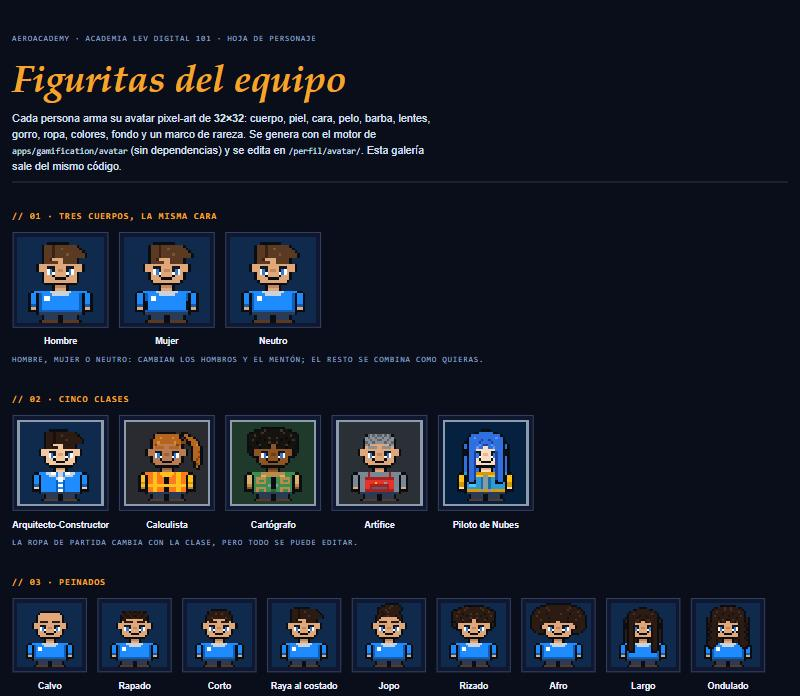

# Avatares pixel-art · las figuritas del equipo

Galería navegable: [`design/avatares/galeria.html`](../design/avatares/galeria.html) (se regenera con
`python design/avatares/build_gallery.py`). Código: [`apps/gamification/avatar/`](../apps/gamification/avatar/).
Editor: `/perfil/avatar/` en la aplicación.

## Qué se busca

Que cada persona **arme su propia figurita**: hombre, mujer o neutro; tono de piel; cara; peinado y color; barba o sin barba;
lentes; gorro; ropa y colores; fondo y un marco que muestra su rareza. Se ve en todo el sistema (cabecera, equipo, foro,
corte del edificio) y crece con su avance: algunas piezas se desbloquean con insignias. Tiene que verse **profesional y
claro**, pero con gracia.

> **Nota sobre la referencia:** el tablero de Pinterest compartido no se puede leer desde herramientas externas (la página
> carga truncada). Para afinar el estilo contra ese tablero basta con guardar 4 o 5 imágenes en
> `design/avatares/referencias/` y se ajustan paleta y proporciones a ellas.

## Resolución: de 16×16 a 32×32

Con 16×16 no alcanzan los píxeles para peinados, barba, lentes y gorros distintos. Se evaluó y se eligió **32×32**:

| Resolución | Veredicto |
|---|---|
| 16×16 | Cabe un monigote, pero no la variedad pedida. Descartada |
| **32×32** | **Elegida.** Cabeza grande (chibi) con rasgos legibles, 14 peinados, barba, lentes y gorros reconocibles, y se ve nítida desde 64 px |
| 48×48 / 64×64 | Más detalle, pero cada pieza cuesta mucho más dibujarla y se pierde el aire de pixel-art. Queda abierta para una "versión grande" futura |

El avatar completo se muestra en **múltiplos de 32** (32, 64, 96, 128…) y el **busto** (cabeza y hombros, 24×24) se usa en
los tamaños chicos como la cabecera.

## Librerías revisadas

| Opción | Qué es | Licencia | Veredicto |
|---|---|---|---|
| [**DiceBear · pixel-art**](https://dicebear.com/styles/pixel-art) ([npm](https://npmjs.com/package/@dicebear/pixel-art)) | Avatares pixel-art desde una semilla; funciona sin red con `@dicebear/core` | Arte **CC0**, código **MIT** | La mejor referencia del *concepto* (avatar determinista). Pide Node y un paso de build; el proyecto no tiene frontend. La API cambió entre la 9.x y la 10.x |
| [Universal LPC Spritesheet Character Generator](https://github.com/LiberatedPixelCup/Universal-LPC-Spritesheet-Character-Generator) | Editor por capas muy completo | **Mixta** (CC-BY-SA, CC-BY, GPL…, con atribución por pieza) | Descartada: sprites de cuerpo completo de 64×64, créditos por pieza y no es CC0 |
| [0x72 · DungeonTileset](https://opengameart.org/) | Personajes y mazmorras en pixel-art | CC0 según su ficha (verificar en el original) | Inspiración de paleta y proporciones |
| [Kenney](https://kenney-assets.itch.io/pixel-shmup) | Paquetes enormes de arte | **CC0** | Excelente para íconos e insignias; sin generador de personas |
| [Personaje CC0 de 64×64](https://hylsy.itch.io/64x64-pixel-art-character1) | Un personaje con capas y archivo `.piskel` | CC0 | Sirve para aprender a dibujar por capas |

**Decisión (D24):** un **motor propio, sin dependencias**, con el mismo concepto que DiceBear (semilla → avatar estable) pero
hecho a la medida: clases de la academia, piezas del oficio (casco, chaleco reflectante, credencial) y marcos de rareza. No hay
build de frontend, no se envían datos a terceros y todo el arte es nuestro.

## Qué se puede configurar

| Grupo | Opciones |
|---|---|
| Quién eres | **Clase** (5) · **Cuerpo**: Hombre, Mujer o Neutro |
| Cara | **Tono de piel** (8) · **Ojos** (5: puntos, con iris, felices, pestañas, guiño) · **Color de ojos** (5) · **Cejas** (5) · **Boca** (6) |
| Pelo | **Peinado** (14: calvo, rapado, corto, raya al costado, jopo, rizado, afro, largo, ondulado, cola de caballo, moño, melena corta, trenzas, mohicano) · **Color** (12, con azul, rosa y violeta) · **Barba y bigote** (6: sin barba, barba de días, bigote, perilla, barba, barba completa) |
| Accesorios | **Lentes** (7) y su color (5) · **Gorro o sombrero** (10: gorra, gorro de lana, casco de obra, explorador, hélice de dron, audífonos, cinta, boina, pescador) y su color (8) · **Cuello** (5: credencial, bufanda, corbata, pañuelo) |
| Ropa | **Ropa** (10: polera, polerón, chaleco reflectante, chaleco de campo, chaqueta, delantal, bata, camisa, chaqueta de vuelo, sweater) y su color (10) · **Parte de abajo** (pantalón, short, falda) y su color (6) |
| Fondo y marco | **Fondo** (8) · **Marco** por rareza (común, raro, épico, legendario) |

Todo es opcional: sin elegir nada, `default_config(login)` da a cada persona una figurita **distinta y estable** desde su primer
ingreso. El editor tiene **vista previa en vivo**, "Sorpréndeme" (aleatorio), "Restablecer" y un candado con el nombre de la
insignia en lo que aún no se desbloquea.

| Pieza | Se gana con |
|---|---|
| Casco de obra | *Primer Trofeo* |
| Gafas de piloto | *Alas DGAC* |
| Sombrero de explorador | *Explorador Multi-vendor* |
| Audífonos | *Mentor* |
| Gorro con hélice de dron | *Constructor de Puentes* |
| Marco raro / épico / legendario | *Tríada Autodesk* / *Reliquia Bentley* / *Constructor de Puentes* |

Todo lo demás es libre. La validación es del lado del servidor: `clean_config(..., unlocked=...)` descarta lo bloqueado y todo valor
fuera del catálogo; el SVG se arma solo con piezas del catálogo (nada que escriba la persona entra al marcado).

## Cómo funciona por dentro

- **Grilla de 32×32** de arte ASCII; cada letra es un color (`K` contorno, `S` piel, `H` pelo, `O` ropa, `T` gorro…, ver `art.py`).
- **Capas** (de atrás hacia adelante): pelo atrás → gorro atrás → cuerpo → ropa → cuello → barba → nariz → boca → ojos → cejas →
  lentes → pelo frente → gorro frente.
- **Cuerpo base** (`parts/body.py`) es el ancla de coordenadas; las piezas se dibujan encima. La ropa solo decora las celdas de ropa
  del cuerpo (no cambia la silueta), así que cualquier ropa va con cualquier cuerpo.
- **Colores**: las claves de arte se resuelven con paletas (`palettes.py`), así que cada pieza sirve con todos los colores.
- **SVG**: un `<path>` por color (~2 KB por avatar) y `shape-rendering="crispEdges"`; con título y `role="img"`.
- **Datos**: `Person.avatar_config` (JSON). Etiqueta de plantilla `` para mostrarlo en cualquier página.

## Que todas las piezas encajen

Con tantas combinaciones (14 peinados × 10 gorros × 7 lentes × 6 barbas × 5 ojos × 6 bocas × 3 cuerpos…) no se puede revisar
a ojo. Hay **reglas de encaje en el motor** y una **auditoría automática**:

- **Lentes y ojos:** los lentes transparentes se dibujan *debajo* de los ojos, así los ojos siempre se ven dentro del lente; los
  de sol y los de piloto (opacos) van encima.
- **Gorros y pelo:** con gorro, el pelo se recorta por encima de la copa (no asoma), y asoma por los lados como en la vida real.
- **La cara es sagrada:** ni el pelo ni un gorro dibujan sobre ojos, nariz o boca (el motor lo recorta aunque una pieza nueva se
  equivoque).
- **Barba y boca:** la boca siempre se dibuja encima de la barba.
- **Ropa:** solo decora las celdas de ropa del cuerpo, por eso sirve con los tres cuerpos.

`python tools/audit_avatar.py` recorre todos los pares de piezas y avisa de ojos tapados, boca tapada, gorros sobre la cara, mechones
sobre la cara, píxeles sueltos y pelo que asoma sobre un gorro. Es además una prueba (`tests/test_avatar_audit.py`), así que una
pieza nueva que choque rompe el CI. Para **verlo**: `python tools/preview_avatar.py salida.png --matrix headwear hair` genera una hoja
que cruza dos categorías.

## Cómo hacerlo visible y claro

1. **Un solo componente** (``): ya está en la **cabecera** y enlaza al editor. Falta sumarlo (Bloque 14 y
   siguientes) a la **tabla del equipo**, las **respuestas del foro** y las **notas**, y reemplazar las iniciales del **corte del
   edificio** por la figurita de 28 px de cada persona.
2. **Reglas de legibilidad** (también en la galería):
   - contorno oscuro de 1 px en todas las piezas, para que se lea sobre fondo claro y oscuro;
   - máximo 3 tonos por zona y una paleta común para toda la familia;
   - la clase se reconoce por la **ropa** (corbata, chaleco reflectante, chaleco de campo, delantal, chaqueta de vuelo);
   - el marco comunica la rareza con color; lo bloqueado muestra su candado y la insignia que lo abre;
   - busto en tamaños de 24 a 48 px y figura completa desde 64 px, siempre múltiplos enteros;
   - sin animaciones que parpadeen: solo un salto de 3 px al pasar el cursor, apagado con *reduced motion*.
3. **Alt y título** en cada SVG, con el nombre de la persona.

## Ideas para que sea entretenido

- **Reacciones**: la figurita sonríe o guiña al subir de nivel; Teo aparece a su lado.
- **Disfraz por mundo**: en el mundo Civil se pone el chaleco; en Aero, las gafas de piloto.
- **Vitrina**: arriba de la hoja, la figurita a 128 px con su marco y su título.
- **Foto del gremio** con todas las figuritas, para el tablón semanal.
- **Temporadas**: accesorios de temporada que no se vuelven a emitir (gorro de invierno, casco de verano).
- **Pegatinas del foro**: la figurita en 5 poses (celebra, piensa, duda, aplaude, señala) como reacciones.
- **Más piezas**: pañoleta de equipo, tatuajes, pecas, aros, mochila de campo, trípode al hombro.

## Ideas de títulos

Los títulos se desbloquean por nivel y la persona elige cuál mostrar (`seed/titulos.json`). Sumados, según el oficio:

| Nivel | General | Arquitecto-Constructor | Calculista | Cartógrafo | Artífice | Piloto de Nubes |
|---|---|---|---|---|---|---|
| 2 | Novato de Faena | | | | | |
| 3 | | | Aprendiz de Rasante | | Aprendiz de Taller | |
| 4 | Jalonero | | | | | |
| 5 | | Trazador de Plantas | | Cazador de Vértices | Forjador de Piezas | Piloto de Faja Ancha |
| 6 | Operador de Cuadrilla | | | | | |
| 7 | | | Maestro del Peralte | | | |
| 8 | Cazador de Colisiones | | | | | |
| 10 | | Orquestador de Vistas | Domador de Corredores | | | Cazador de Nubes |
| 12 | Guardián del Estándar | | | | | |
| 13 | | | | | Maestro del Ensamble | Capitán de Misión |

Ideas para títulos **especiales** (con insignia): *Cerrador de Poligonales*, *Constructor de Puentes*, *Sabio del Foro*,
*Mano de Obra Fina* (100 % de una ruta sin errores en el quiz) y *Faro del Gremio* (5 respuestas aceptadas).

## Cómo se construyó: subagentes + skills

El arte se dibujó en paralelo con **cuatro subagentes `artista-pixel`** (`.claude/agents/artista-pixel.md`), cada uno con su
módulo y un contrato verificable: peinados (`hair.py`), cara y barba (`face.py`, `facial_hair.py`), gorros y lentes (`headwear.py`,
`glasses.py`) y ropa (`outfits.py`). Mientras tanto se construyeron el motor y el editor. Herramientas del flujo:

- `python tools/validate_part.py <categoría>`: valida tamaños, claves de color, rangos de filas e ids obligatorios.
- `python tools/preview_avatar.py salida.png --sheet hair scale=6`: genera una hoja PNG con todos los estilos para **verla**.
- `python tools/show_base.py`: imprime el cuerpo base con regla de coordenadas.
- `tests/test_avatar_engine.py` comprueba el contrato de todas las piezas y que **cada opción se vea distinta** de las demás.

## Cómo agregar o mejorar una pieza

1. Lanza un `artista-pixel` (o dibújala tú) en el módulo de `parts/` que corresponda, respetando el docstring (contrato).
2. `python tools/validate_part.py <categoría>` hasta que diga "sin errores"; mira la hoja con `preview_avatar.py`.
3. Si se desbloquea, ligala a una insignia en `UNLOCKS` (`engine.py`); la prueba `test_every_unlock_points_to_a_real_piece_and_a_real_badge` evita typos.
4. Regenera la galería y revisa a 24, 32 y 128 px, con pieles y pelos claros y oscuros y con los tres cuerpos.
